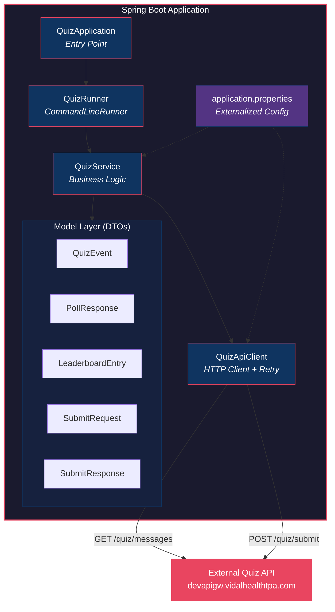
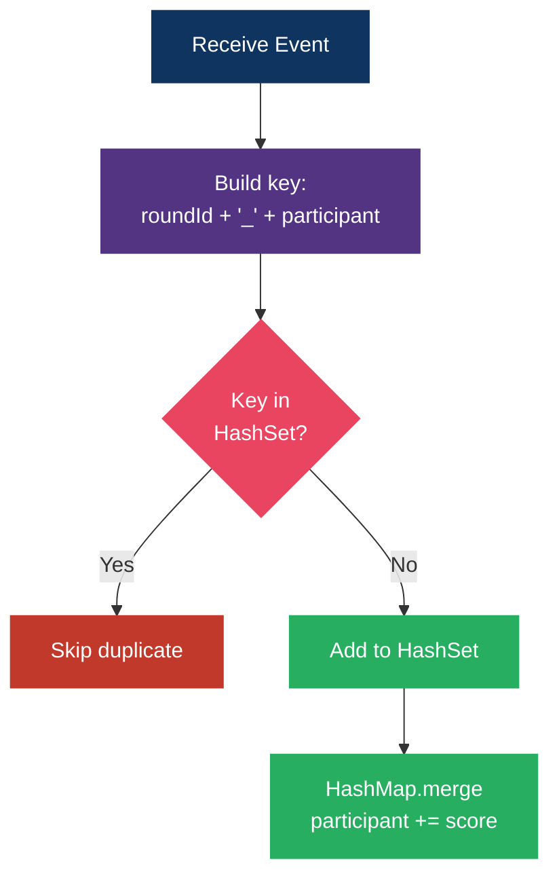

# Bajaj Finserv Health — Quiz Leaderboard System

A production-quality **Spring Boot** backend application that consumes an external quiz API, processes score events with deduplication, generates a ranked leaderboard, and submits it for validation.

**Registration No:** `RA2311003011748`

---

## Problem Statement

The task is to build a backend system that:

1. **Polls** an external quiz API **10 times** (poll index 0–9) with a mandatory **5-second delay** between each call
2. **Collects** all score events from each poll response
3. **Deduplicates** events — the same event can appear across multiple polls
4. **Aggregates** scores per participant after removing duplicates
5. **Sorts** participants by total score in **descending order**
6. **Submits** the final leaderboard **exactly once** to a validation endpoint

### Why Deduplication Matters

The API intentionally returns overlapping data across polls to simulate real-world event streaming where duplicates are common. The deduplication key is:

```
roundId + "_" + participant
```

> **Design Decision:** To ensure idempotency, I used a `HashSet<String>` to track processed `(roundId + participant)` combinations and avoided reprocessing duplicate events. This guarantees that each unique event is counted exactly once, regardless of how many times it appears across polls.

---

## Architecture

### System Architecture



### Component Breakdown

| Component | File | Responsibility |
|-----------|------|----------------|
| **Entry Point** | `QuizApplication.java` | Spring Boot main class |
| **Runner** | `QuizRunner.java` | Triggers pipeline on startup via `CommandLineRunner` |
| **Service** | `QuizService.java` | Core logic — poll, dedup, aggregate, sort, submit |
| **API Client** | `QuizApiClient.java` | HTTP calls with retry logic (3 retries, 2s backoff) |
| **Models** | `model/*.java` | 5 clean DTOs: QuizEvent, PollResponse, LeaderboardEntry, SubmitRequest, SubmitResponse |
| **Config** | `application.properties` | All externalized configuration — nothing hardcoded |
| **Tests** | `DeduplicationTest.java` | 4 JUnit 5 tests for core dedup/aggregation logic |

---

## Project Structure

```
bajaj-quiz-leaderboard/
├── pom.xml                              # Maven build config
├── README.md                            # This file
├── .gitignore                           # Git ignore rules
└── src/
    ├── main/
    │   ├── java/com/bajaj/quiz/
    │   │   ├── QuizApplication.java     # Spring Boot entry point
    │   │   ├── runner/
    │   │   │   └── QuizRunner.java      # Auto-runs on startup
    │   │   ├── client/
    │   │   │   └── QuizApiClient.java   # HTTP client + retry logic
    │   │   ├── service/
    │   │   │   └── QuizService.java     # Core business logic
    │   │   └── model/
    │   │       ├── QuizEvent.java       # Single score event
    │   │       ├── PollResponse.java    # Poll API response
    │   │       ├── LeaderboardEntry.java# Leaderboard row
    │   │       ├── SubmitRequest.java   # Submit POST body
    │   │       └── SubmitResponse.java  # Submit response
    │   └── resources/
    │       └── application.properties   # All config values
    └── test/
        └── java/com/bajaj/quiz/
            └── DeduplicationTest.java   # 4 unit tests
```

**Total: 13 files** — clean, layered, production-quality structure.

---

## Data Flow Pipeline

```mermaid
flowchart LR
    A["POLL<br/>0 to 9<br/><i>5s delay</i>"] -->|Raw Events| B["COLLECT<br/>All Events<br/><i>ArrayList</i>"]
    B -->|15 events| C["DEDUPLICATE<br/>roundId + participant<br/><i>HashSet</i>"]
    C -->|10 unique| D["AGGREGATE<br/>Score per user<br/><i>HashMap.merge</i>"]
    D -->|3 participants| E["SORT<br/>Descending<br/><i>Stream.sorted</i>"]
    E -->|Ranked list| F["SUBMIT<br/>POST once<br/><i>Idempotent guard</i>"]

    style A fill:#e94560,stroke:#e94560,color:#fff
    style B fill:#0f3460,stroke:#0f3460,color:#fff
    style C fill:#533483,stroke:#533483,color:#fff
    style D fill:#0f3460,stroke:#0f3460,color:#fff
    style E fill:#533483,stroke:#533483,color:#fff
    style F fill:#e94560,stroke:#e94560,color:#fff
```



### Deduplication Logic



### Step-by-Step:

1. **Poll (0–9):** Call `GET /quiz/messages?regNo=...&poll=N` with 5s delay between each
2. **Collect:** Accumulate all events into a master list
3. **Deduplicate:** Track `roundId_participant` in a `HashSet` — skip if already seen
4. **Aggregate:** Sum scores per participant using `HashMap.merge()`
5. **Sort:** Stream → sort by `totalScore` descending
6. **Submit:** `POST /quiz/submit` with `hasSubmitted` boolean guard for idempotency

---

## Prerequisites

Before running this project, make sure you have:

| Tool | Version | Check Command |
|------|---------|---------------|
| **Java JDK** | 17 or higher | `java -version` |
| **Apache Maven** | 3.6+ | `mvn -version` |
| **Git** | Any | `git --version` |

### Installing Prerequisites (Windows)

**Option A — Using installers:**
1. **Java 17:** Download from [Oracle JDK 17](https://www.oracle.com/java/technologies/javase/jdk17-archive-downloads.html) or [Adoptium](https://adoptium.net/) → Install → Add to PATH
2. **Maven:** Download from [maven.apache.org](https://maven.apache.org/download.cgi) → Extract → Add `bin/` folder to PATH

**Option B — Using Chocolatey (recommended):**
```bash
choco install temurin17
choco install maven
```

**Option C — Using SDKMAN (Linux/Mac):**
```bash
sdk install java 17.0.9-tem
sdk install maven
```

---

## How to Run

### 1. Clone the Repository
```bash
git clone https://github.com/YOUR_USERNAME/bajaj-quiz-leaderboard.git
cd bajaj-quiz-leaderboard
```

### 2. Build the Project
```bash
mvn clean install
```
This compiles the code, runs all 4 unit tests, and packages the application.

### 3. Run the Application
```bash
mvn spring-boot:run
```

The application will:
- Start Spring Boot
- Automatically trigger the quiz pipeline
- Poll the API 10 times (takes ~50 seconds)
- Process and deduplicate events
- Submit the leaderboard
- Print the result

### 4. Expected Console Output
```
18:30:00 [main] INFO  QuizService - ═══════════════════════════════════════════════
18:30:00 [main] INFO  QuizService -   Bajaj Quiz Leaderboard — Starting Pipeline
18:30:00 [main] INFO  QuizService - ═══════════════════════════════════════════════
18:30:00 [main] INFO  QuizApiClient - Polling API: poll=0 (attempt 1/3)
18:30:01 [main] INFO  QuizApiClient - Poll 0 response received. Events count: 5
...
18:30:50 [main] INFO  QuizService - All polls complete. Total raw events collected: 47
18:30:50 [main] INFO  QuizService - Deduplication complete. Duplicates skipped: 12 | Unique entries: 18
18:30:50 [main] INFO  QuizService - ───────────────────────────────────────────────
18:30:50 [main] INFO  QuizService -   FINAL LEADERBOARD (X participants)
18:30:50 [main] INFO  QuizService - ───────────────────────────────────────────────
18:30:50 [main] INFO  QuizService -   Rank  1 | Alice                | Score: 100
18:30:50 [main] INFO  QuizService -   Rank  2 | Bob                  | Score: 80
...
18:30:51 [main] INFO  QuizService - ═══════════════════════════════════════════════
18:30:51 [main] INFO  QuizService -   SUBMISSION RESULT
18:30:51 [main] INFO  QuizService - ═══════════════════════════════════════════════
18:30:51 [main] INFO  QuizService -   isCorrect    : true
18:30:51 [main] INFO  QuizService -   isIdempotent : true
18:30:51 [main] INFO  QuizService -   message      : Correct!
18:30:51 [main] INFO  QuizService - ═══════════════════════════════════════════════
18:30:51 [main] INFO  QuizService - ✅ SUCCESS — Leaderboard accepted correctly!
```

---

## Running Unit Tests

```bash
mvn test
```

### Test Coverage

| Test | What It Validates |
|------|-------------------|
| `testNoDuplicates_basicAggregation` | Basic score summing works correctly |
| `testDuplicateEventsIgnored` | Same `roundId + participant` counted only once |
| `testSortDescending` | Leaderboard ordered highest score first |
| `testTotalScoreCorrect` | Combined total is accurate after dedup |

---

## Design Decisions

| Decision | Rationale |
|----------|-----------|
| **HashSet for dedup** | O(1) lookup — efficient even for large datasets |
| **HashMap.merge()** | Clean, functional score accumulation |
| **`hasSubmitted` guard** | Prevents accidental double-submission (idempotency) |
| **Retry logic (3x)** | Real-world APIs can fail — graceful degradation |
| **Config in properties** | Nothing hardcoded — easy to change without recompilation |
| **CommandLineRunner** | Auto-executes on startup — no manual trigger needed |
| **Layered architecture** | Separation of concerns — client / service / runner / model |

---

## API Reference

### Poll Endpoint
```
GET /quiz/messages?regNo=RA2311003011748&poll={0-9}
```
**Response:**
```json
{
  "regNo": "RA2311003011748",
  "setId": "SET_1",
  "pollIndex": 0,
  "events": [
    { "roundId": "R1", "participant": "Alice", "score": 10 },
    { "roundId": "R1", "participant": "Bob", "score": 20 }
  ]
}
```

### Submit Endpoint
```
POST /quiz/submit
Content-Type: application/json
```
**Request:**
```json
{
  "regNo": "RA2311003011748",
  "leaderboard": [
    { "participant": "Alice", "totalScore": 100 },
    { "participant": "Bob", "totalScore": 80 }
  ]
}
```
**Response:**
```json
{
  "isCorrect": true,
  "isIdempotent": true,
  "submittedTotal": 180,
  "expectedTotal": 180,
  "message": "Correct!"
}
```

---

## Tech Stack

| Technology | Purpose |
|-----------|---------|
| Java 17 | Language runtime |
| Spring Boot 3.2.0 | Application framework |
| Spring Web | REST client (RestTemplate) + Jackson JSON |
| Lombok | Reduces boilerplate code |
| JUnit 5 | Unit testing framework |
| Maven | Build & dependency management |

---

## Author

**Lakshya Sabharwal** — Registration No: `RA2311003011748`

---

## License

This project is submitted as part of the Bajaj Finserv Health recruitment assignment.
